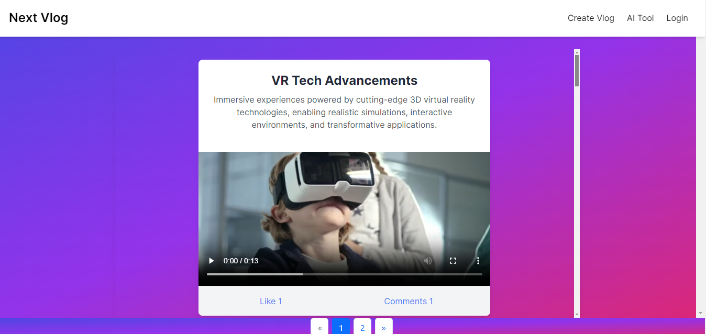
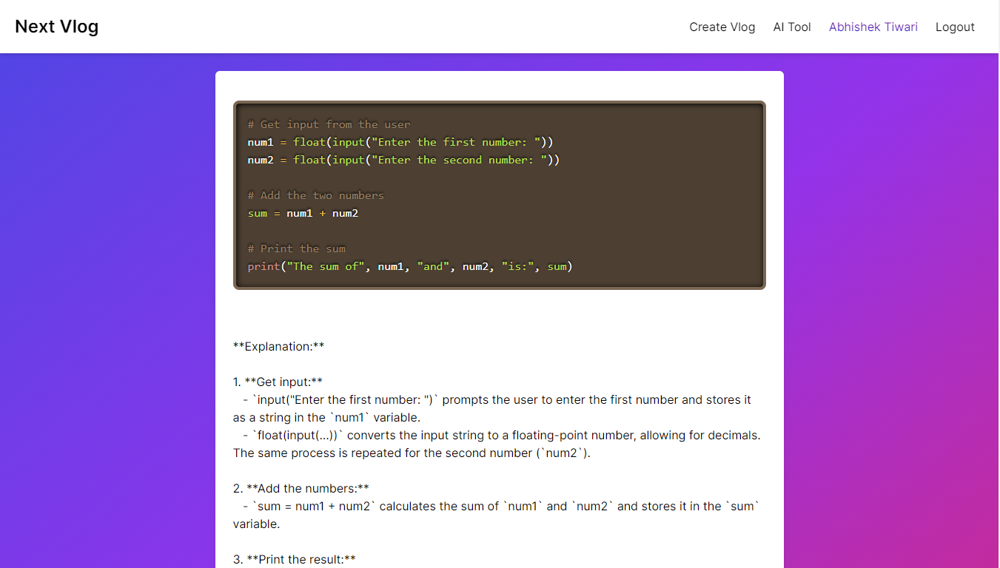
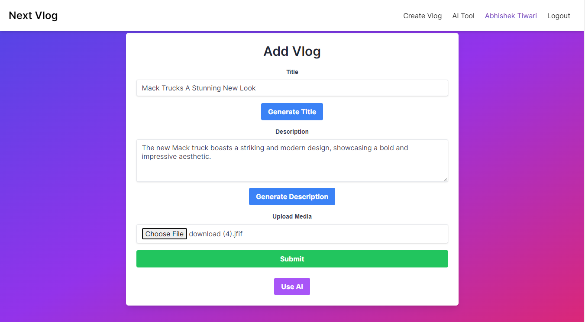
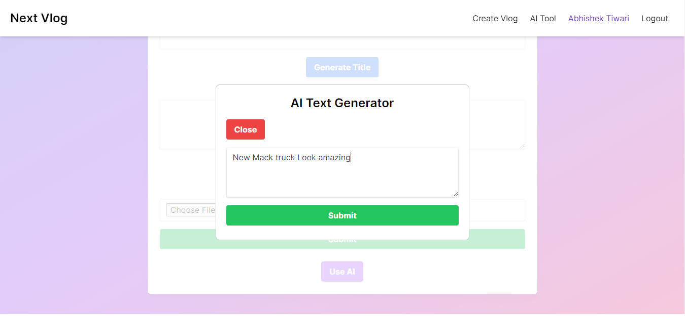
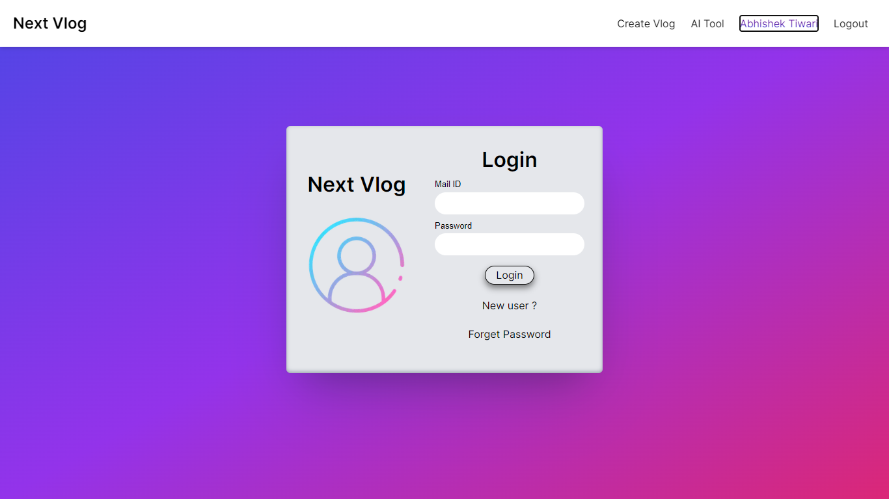
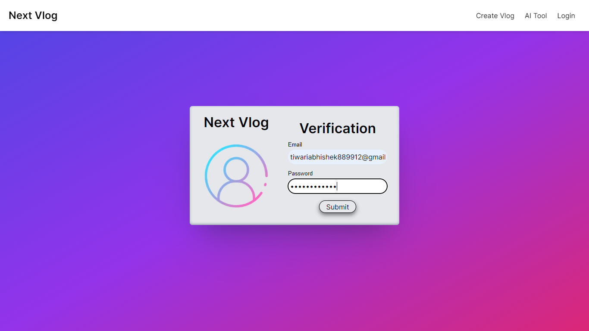
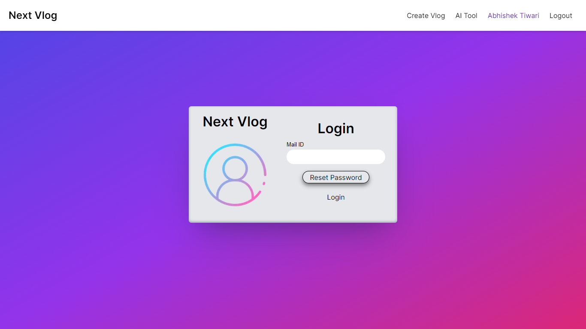

# Next-Vlog

A comprehensive platform designed for creating and sharing multimedia-rich blogs with community interaction and AI-powered enhancements.

## Features

- **Create Blogs:** Effortlessly create and publish blogs with titles, descriptions, images, and videos.
- **Multimedia Sharing:** Share videos and photos directly within the platform.
- **Interact:** Engage with the community by liking and commenting on blog posts, videos, and photos.
- **AI Integration:** Utilize Gemini AI to generate optimized titles and descriptions from provided content, and receive AI-driven insights and suggestions.
- **Secure Media Storage:** Store images and videos securely using Firebase Storage.
- **State Management:** Manage application state efficiently with Redux Toolkit.
- **Validation:** Ensure data integrity and correctness using Zod.
- **Responsive Design:** Enjoy a seamless user experience across various devices and screen sizes.
- **Accessibility:** Follow best practices for accessibility to ensure equal access for all users.
- **Forget Password:** Recover your account with a secure password reset process using Nodemailer.
- **Verification:** Verify your email address to ensure account security and authenticity using Nodemailer.
- **Pagination:** Efficiently navigate through blog posts using pagination on the blog page.

## Technologies Used

- **Frontend:** Next.js for a seamless and fast user interface.
- **Backend:** Next.js for a seamless and fast API responses.
- **State Management:** Redux Toolkit for managing application state.
- **Validation:** Zod for data validation and integrity.
- **AI Services:** Gemini AI for generating content and insights.
- **Database:** MySQL for robust and reliable data storage.
- **Media Storage:** Firebase Storage for secure handling of multimedia files.
- **Nodemailer:** Nodemailer for mail services, including forget password and user verification.

## About the Project

I created this website as a learning project to get familiar with Next.js and MySQL. It was a challenging but rewarding experience to build a fully functional blog platform in just 15 days. I hope that this project can serve as a helpful resource for others who are learning these technologies.

## Server Security

- Sanatized body,query and params.
- IP Address bocker for too many request.
- token blacklisting for too many unethical requests.

## Getting Started

Instructions for setting up and running the project locally are provided to ensure an easy start for developers.

### Prerequisites

- Node.js and npm
- MySQL
- A Firebase account for setting up media storage
- A Gemini AI account for AI services
- A Nodemailer account for mail services

### Installation

1. **Clone the repository:**

git clone https://github.com/DevWebAbhi/next-vlog-app.git

2. **cd next-vlog-app**
   - "For changing directory to root"

3. **npm instal**  
   - "For installing dependencies"

### Starting Server   

1. **npm run dev**
   - "For starting the server"   

### Build

1. **npm run build**
   -- For building the Nextjs app  so that you will ensure no error will occur in deployement of application    

## Interface

### Home
    - All Blogs will be visible here in this page and pagination is there in every page 10 vlogs can come and we can like and comment on blogs as well here
  

### AI Page
   - Its Ai prompt editor to resove your queries
   

### Create Blog
    - Here we are able to create blog and generate the title and description with the help of ai and upload images or videos if we want
  

### Create Blog AI Title and Description Generation Promt editor
    - Here we are providing the text to ai for title and descriptio generation
  

### Login
    - Login
    

### Signup
    - Signup
  

### Verification
    - Verification
  

### Forget Password
    - Forget Password
  

### Reset Password
    - Reset Password
  

